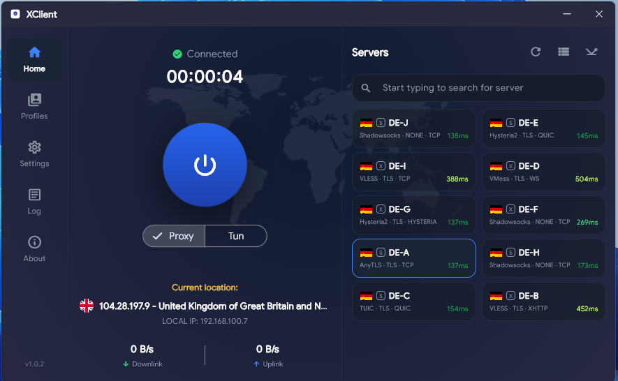
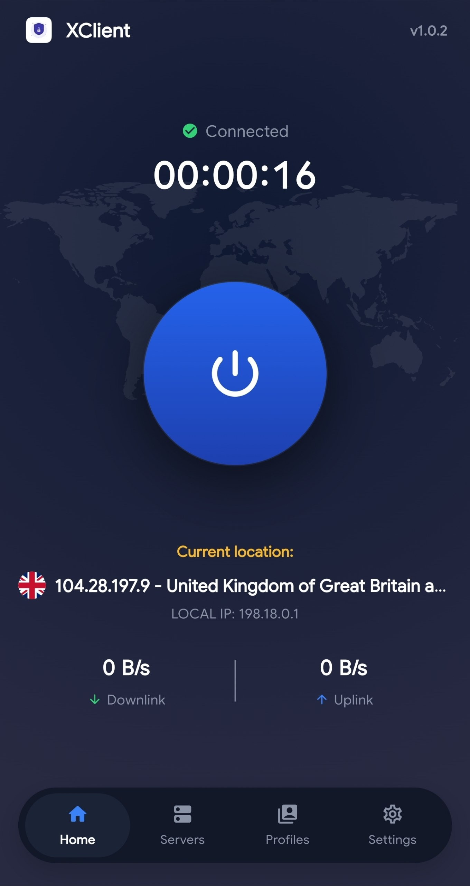
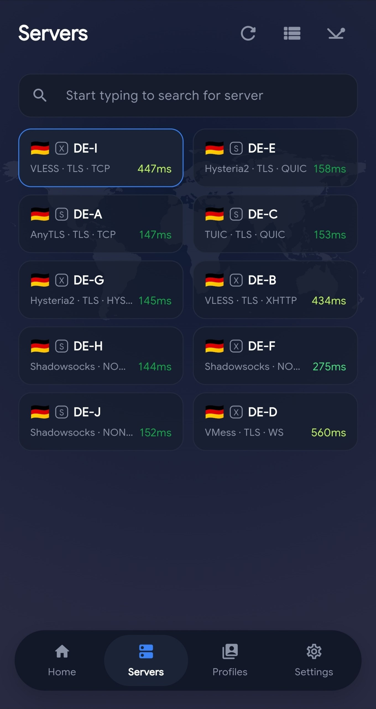
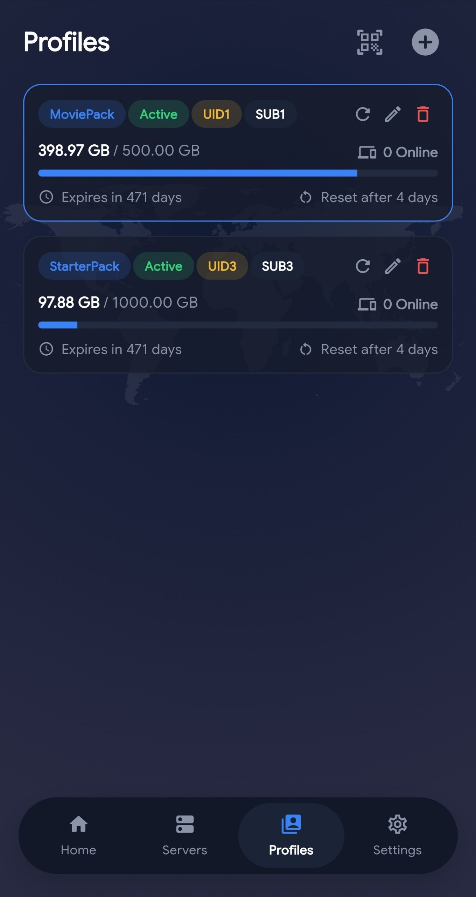
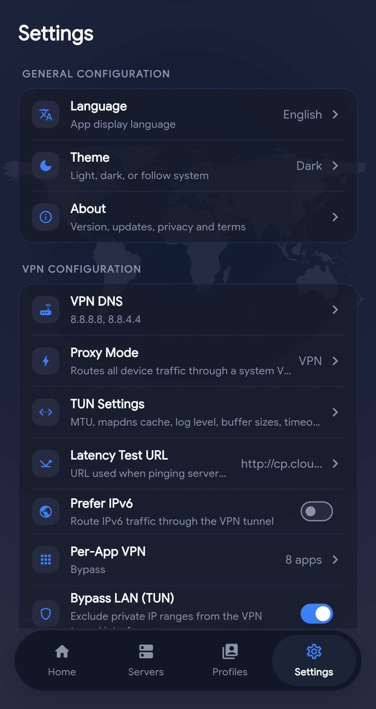

# XClient

A proxy client for [XMPlus Panel](https://github.com/XMPlusDev/XMPlusRelease) that supports **xray-core** and **sing-box**.

XClient connects to nodes delivered by an XMPlus panel subscription and runs them through either
xray-core or sing-box servers side by side. Each server in the
list is tagged with the core it runs on — `X` for xray-core, `S` for sing-box.

## Features

- **One-tap connect** — single power button with a live connection timer.
- **Dual core** — xray-core and sing-box in the same client, selected per server.
- **Proxy and TUN mode** — run as a local proxy or capture system-wide traffic through a TUN device.
- **Subscription profiles** — add profiles by host and password or by scanning a QR code, and keep
  several side by side. Each card shows data used against quota, expiry, the next traffic reset
  and how many devices are online.
- **Latency testing** — measure and display ping for every server, with one-tap refresh for all nodes.
- **Server search** — filter large node lists by name as you type.
- **Live traffic stats** — real-time downlink and uplink speeds.
- **Connection info** — exit IP with country flag and local IP shown at a glance.
- **Per-app VPN** — pick which apps bypass or use the tunnel.
- **Network configuration** — custom VPN DNS, TUN options (MTU, buffer sizes, timeouts, log level),
  latency test URL, IPv6 preference and LAN bypass.
- **Light and dark themes**, with a selectable app language.
- **Built-in log viewer** — inspect core output without leaving the app.

## Screenshots

### Desktop

### Mobile

| Home | Servers |
| :---: | :---: |
|  |  |

| Profiles | Settings |
| :---: | :---: |
|  |  |

## Getting started

1. Download the build for your platform from the [Releases](https://github.com/XMPlusDev/XClient/releases) page.
2. Open **Profiles** and add your XMPlus panel subscription hostand password.
3. Refresh the profile to pull the node list, then pick a server from **Servers**.
4. Choose **Proxy** or **TUN** mode and hit the power button.
